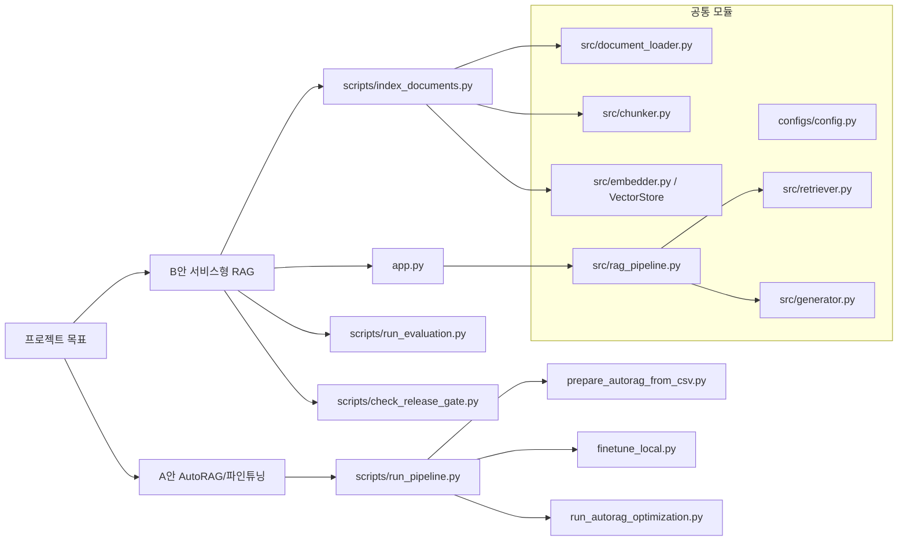
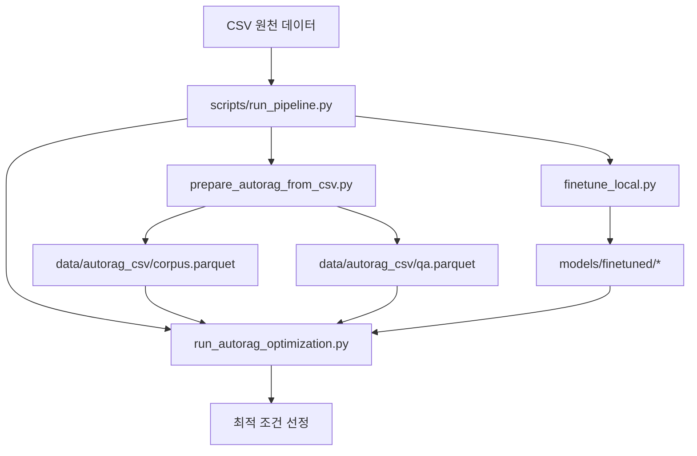
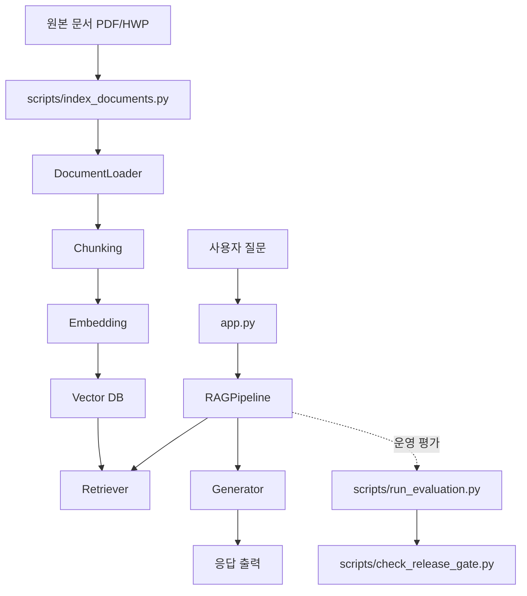

# sprint_ai_07_middle

기업/공공 RFP 문서를 대상으로 한 RAG 시스템 프로젝트입니다.

현재 저장소는 아래 세 축으로 구성됩니다.

1. 서비스형 RAG 앱/파이프라인
2. AutoRAG 기반 A안 최적화/파인튜닝 파이프라인
3. 운영용 평가 및 릴리즈 게이트

이 문서는 "지금 이 저장소를 어떻게 실행하고 이해해야 하는가"를 기준으로 정리했습니다.
세부 구현 책임은 `docs/` 문서를 참고하되, 실행 순서와 현재 상태는 이 README를 우선합니다.

---

## 문서 허브

- 아키텍처/개발 흐름: `docs/ENGINEERING_GUIDE.md`
- 코드 책임 분리 맵: `docs/CODEBASE_MAP.md`
- 구조 도식: `docs/diagram.md`
- 발표용 도식 초안: `docs/diagram_presentation.md`
- 평가 실행/게이트 기준: `docs/EVALUATION_GUIDE.md`
- 멀티 사용자 운영/보안 가이드: `docs/OPS_SECURITY_MULTIUSER.md`
- AutoRAG 실험/배포 가이드: `docs/AUTORAG_GUIDE.md`
- 노트북 실행 가이드: `docs/NOTEBOOK_GUIDE.md`
- 보고서 템플릿: `docs/REPORT_TEMPLATE.md`

## 구조 개요

### A안: 로컬 모델 + AutoRAG 중심

- 목적: 로컬 모델로 AutoRAG를 돌려 검색/프롬프트/생성 조건을 비교하고, 최적 조건으로 RAG를 구축
- 핵심 경로:
  - 데이터셋 생성: `scripts/prepare_autorag_from_csv.py`
  - 통합 파이프라인: `scripts/run_pipeline.py`
  - AutoRAG 실행: `scripts/run_autorag_optimization.py`
  - 로컬 파인튜닝: `scripts/finetune_local.py`
- 주요 산출물:
  - `data/autorag_csv/corpus.parquet`
  - `data/autorag_csv/qa.parquet`
  - `evaluation/autorag_benchmark_csv/`
  - `models/finetuned/*`

### B안: OpenAI API 기반 서비스형 RAG

- 목적: GPT API와 OpenAI 임베딩을 사용해 서비스형 RAG 생성 및 평가
- 핵심 경로:
  - 인덱싱: `scripts/index_documents.py`
  - 앱 실행: `app.py`
  - 평가: `scripts/run_evaluation.py`
  - 릴리즈 게이트: `scripts/check_release_gate.py`
- 주요 산출물:
  - `data/processed/*_chunks.json`
  - `data/vectordb/`
  - `evaluation/`

### 공통 모듈

- 설정: `configs/config.py`
- 로딩/청킹/검색/생성: `src/document_loader.py`, `src/chunker.py`, `src/embedder.py`, `src/retriever.py`, `src/generator.py`
- 오케스트레이션: `src/rag_pipeline.py`

## 구조 도식

상세 버전은 `docs/diagram.md`, 발표용 레이아웃은 `docs/diagram_presentation.md`를 참고하세요.

### 전체 구조



### A안 구조



### B안 구조



---

## 1) 최종 구현 범위

### A. RAG 서비스

| 항목 | Scenario B (OpenAI API) | Scenario A (로컬 HuggingFace) |
|------|------------------------|------------------------------|
| 문서 로딩 | PDF / HWP | 동일 |
| 청킹 | naive / semantic | 동일 |
| 임베딩 | text-embedding-3-small (dim=512) | BGE-m3-ko / ko-sroberta / E5-large / KoSimCSE / kf-DeBERTa (AutoRAG 5종 비교) |
| 검색 | similarity / MMR / hybrid + multi-query / rerank | 동일 |
| 생성 | gpt-5-mini / gpt-5-nano / gpt-5 | EXAONE / Gemma3 / Gemma4 / kanana / Midm 등 로컬 모델 |
| 대화 메모리 | 슬라이딩 윈도우 (최근 5턴) | 동일 |
| UI | Streamlit 앱 (사이드바에서 A/B 전환) | 동일 |

핵심 엔트리:
- `app.py`
- `src/rag_pipeline.py`

### B. AutoRAG 실험/배포

| config 파일 | 데이터 | 시나리오 | Generator | 임베딩 |
|------------|--------|---------|-----------|--------|
| `configs/autorag/local_csv.yaml` | `data/autorag_csv/` | A (GPU 서버, **권장**) | vllm — 5종 모델 | 5종 동일 |
| `configs/autorag/local_csv_pipeline.yaml` | `data/autorag_csv/` | A (GPU 서버, 파이프라인) | vllm — 원본+파인튜닝 모델 | 5종 동일 |
| `configs/autorag/tutorial.yaml` | `data/autorag/` | B (OpenAI) | openai_llm — gpt-5-mini | text-embedding-3-small |
| `configs/autorag/local.yaml` | `data/autorag/` | A (GPU 서버, PDF/HWP) | vllm — 5종 모델 (Gemma4 제외) | 5종 (BGE / sroberta / E5 / SimCSE / DeBERTa) |
| `configs/autorag/local_gemma4.yaml` | `data/autorag/` | A (GPU 서버, Gemma4 전용) | vllm — Gemma4-E4B | 5종 동일 |
| `configs/autorag/local_pc.yaml` | `data/autorag/` | A-PC (8GB GPU) | vllm — 4종 모델 | BAAI/bge-m3 + ko-sroberta (HF Hub) |

`local_csv.yaml` 특징: CSV 기반 ground truth (retrieval_gt 100% 정확, generation_gt 실제 텍스트), `max_tokens: [256, 512, 1024]` 비교, 프롬프트 3종.

핵심 엔트리:
- `scripts/prepare_autorag_from_csv.py` — CSV 기반 corpus/qa 생성 (권장)
- `scripts/prepare_autorag_data.py` — PDF/HWP 기반 corpus/qa 생성
- `scripts/run_autorag_optimization.py`
- `scripts/download_models.py` — 생성 모델(Gemma4-E4B) + 임베딩 3종 다운로드
- `scripts/run_gemma4_optimization.sh` — Gemma4 별도 실행
- `scripts/merge_gemma4_results.py` — Gemma4 결과 병합
- `apps/autorag_api.py`, `apps/autorag_streamlit.py`

### C. 평가 프레임워크 (분리 설계)
- `core` 모드: 운영 핵심 지표 중심 (빠르고 비용 절감)
- `detailed` 모드: 모델/프롬프트/튜닝 분석 지표 포함

현재 구현 기준:
- 서비스 평가 스크립트(`scripts/run_evaluation.py`)는 사실상 **B안(OpenAI 기반)** 기준으로 작성되어 있습니다.
- A안 AutoRAG 평가는 `scripts/run_autorag_optimization.py` 및 `scripts/run_pipeline.py` 경로를 사용합니다.

핵심 엔트리:
- `scripts/run_evaluation.py`
- `scripts/check_release_gate.py`
- `src/evaluation/*`

### D. 파인튜닝
- `scripts/finetune_local.py`: LoRA / QLoRA (로컬 오픈소스 모델)
- `scripts/finetune_openai.py`: OpenAI Fine-tuning API

---

## 2) 설치

```bash
pip install -r requirements.txt
```

AutoRAG 실험은 메인 스택과 의존성 충돌 가능성이 있어 별도 환경 또는 `requirements-autorag.txt` 사용을 권장합니다.

```bash
pip install -r requirements-autorag.txt
```

`requirements.txt`에서 통합 관리하는 주요 패키지:
- RAG: `openai`, `langchain-text-splitters`, `chromadb`, `faiss-cpu`
- HuggingFace (Scenario A): `transformers`, `sentence-transformers`, `torch`, `accelerate`
- 평가: `rouge-score`, `nltk`, `bert-score`, `ragas`
- 서비스: `streamlit`, `fastapi`, `uvicorn`

파인튜닝 추가 패키지:
```bash
pip install peft trl bitsandbytes accelerate datasets
```

설치 이슈 메모:
- HWP 파싱은 `olefile` + 내부 파서(`src/document_loader.py`)로 동작합니다.
- Scenario A 로컬 모델은 `/srv/shared_data/models/`에서 직접 로드하며 HF_TOKEN이 불필요합니다.
- 로컬 PC에서는 HuggingFace Hub에서 자동 다운로드됩니다 (`HF_HOME` 환경변수로 캐시 경로 지정 가능).

## 3) 현재 검증 상태와 주의사항

### 정적 검증

- `python3 -m compileall app.py configs src scripts apps` 통과

### 확인된 주의사항

- `app.py`의 B안 기본 컬렉션은 `rfp_chunk600`인데, 실제 벡터스토어에 이 컬렉션이 없으면 빈 컬렉션이 새로 생성될 수 있습니다.
- 서비스 평가 스크립트는 B안 전용 흐름에 가깝고, A안 AutoRAG 결과를 동일한 방식으로 직접 검증하지는 않습니다.
- `DocumentLoader`의 일반 파일 로딩은 현재 PDF/HWP 중심입니다. CSV는 `csv_row_per_doc` 특수 모드에서 메타데이터 CSV를 문서처럼 쓰는 경로입니다.
- `scripts/check_env.py`는 환경이 완전하지 않으면 초기에 실패할 수 있으므로, 현재 상태에서는 참고용으로만 봐야 합니다.

### 권장 실행 순서

#### A안

```bash
# 1) CSV 기반 AutoRAG 데이터셋 생성
python scripts/prepare_autorag_from_csv.py --output-dir data/autorag_csv

# 2) AutoRAG만 먼저 검증
python scripts/run_pipeline.py --steps data,autorag

# 3) 필요 시 파인튜닝 포함
python scripts/run_pipeline.py --steps finetune,autorag --finetune-models kanana-1.5
```

#### B안

```bash
# 1) 문서 인덱싱
python scripts/index_documents.py --scenario B --collection rfp_chunk1200

# 2) 앱 실행
streamlit run app.py

# 3) 평가/게이트
python scripts/check_release_gate.py
```

---

## 4) 빠른 실행 가이드

### 3-1. 인덱싱

인덱싱은 **청킹 → 임베딩** 2단계로 구성됩니다.

#### Scenario B (OpenAI API)

```bash
# 기본 (chunk_size=1200)
python scripts/index_documents.py --scenario B --collection rfp_chunk1200

# 비교용 800자 컬렉션
python scripts/index_documents.py --scenario B --chunk-size 800 --collection rfp_chunk800

# CSV 기반 정제 corpus.parquet 직접 임베딩
python scripts/index_documents.py \
  --scenario B \
  --from-parquet data/autorag_csv/corpus.parquet \
  --collection rfp_chunk600

# Batch API 사용 (비용 50% 절감)
python scripts/index_documents.py --scenario B --use-batch-api --collection rfp_chunk1200

# 단계별 실행
python scripts/index_documents.py --scenario B --step chunk --collection rfp_chunk1200
python scripts/index_documents.py --scenario B --step embed --collection rfp_chunk1200
```

#### Scenario A (로컬 HuggingFace)

```bash
# 기본 (BGE-m3-ko 임베딩, chunk_size=1200)
python scripts/index_documents.py \
  --scenario A \
  --hf-embedding-model bge \
  --chunk-size 1200 \
  --collection rfp_chunk1200_a

# 비교용 — ko-sroberta 임베딩 (경량, dim=768)
python scripts/index_documents.py \
  --scenario A \
  --hf-embedding-model sroberta \
  --chunk-size 1200 \
  --collection rfp_chunk1200_a_sroberta

# B안 청킹 파일 재사용 → A안 임베딩만 실행
python scripts/index_documents.py \
  --scenario A --step embed \
  --hf-embedding-model bge \
  --collection rfp_chunk1200_a
```

#### 컬렉션 목록

| 컬렉션명 | 시나리오 | 임베딩 | chunk_size |
|---------|---------|--------|-----------|
| `rfp_chunk600` | B (OpenAI) | text-embedding-3-small (512) | 600 |
| `rfp_chunk1200` | B (OpenAI) | text-embedding-3-small (512) | 1200 |
| `rfp_chunk800` | B (OpenAI) | text-embedding-3-small (512) | 800 |
| `rfp_chunk1200_a` | A (BGE-m3-ko) | BGE-m3-ko (1024) | 1200 |
| `rfp_chunk800_a` | A (BGE-m3-ko) | BGE-m3-ko (1024) | 800 |
| `rfp_chunk1200_a_sroberta` | A (ko-sroberta) | ko-sroberta (768) | 1200 |

> A안과 B안은 임베딩 차원이 달라 컬렉션을 반드시 분리해야 합니다.

---

### 3-2. 서비스 앱 실행

```bash
streamlit run app.py
```

#### 사이드바 주요 설정

| 설정 | Scenario B (OpenAI) | Scenario A (로컬 HF) |
|------|--------------------|--------------------|
| 실행 모드 | B: OpenAI API | A: 로컬 HuggingFace |
| 컬렉션 | rfp_chunk600 / rfp_chunk1200 | rfp_chunk1200_a / rfp_chunk1200_a_sroberta |
| LLM 모델 | gpt-5-mini / gpt-5-nano / gpt-5 | EXAONE / Gemma3 / Gemma4 등 9종 |
| 임베딩 모델 | text-embedding-3-small (고정) | BGE-m3-ko / ko-sroberta 선택 |
| 검색 방식 | similarity / mmr / hybrid | 동일 |
| Reasoning Effort | low / medium / high | 해당 없음 |
| Temperature | 미지원 (gpt-5 계열) | 0.0 ~ 1.0 슬라이더 |

> 실행 모드를 전환하면 컬렉션 목록이 자동으로 해당 시나리오 컬렉션으로 바뀝니다.

---

## 5) AutoRAG 사용 가이드

### 4-1. AutoRAG 데이터 생성

```bash
python scripts/prepare_autorag_data.py \
  --documents-dir data \
  --metadata-csv data/data_list.csv \
  --output-dir data/autorag \
  --chunk-method semantic \
  --chunk-size 600 \
  --chunk-overlap 150
```

산출물: `data/autorag/corpus.parquet`, `data/autorag/qa.parquet`

### 4-2. AutoRAG 최적화

**Scenario B (OpenAI)**
```bash
python scripts/run_autorag_optimization.py \
  --qa-path data/autorag/qa.parquet \
  --corpus-path data/autorag/corpus.parquet \
  --config-path configs/autorag/tutorial.yaml \
  --project-dir evaluation/autorag_benchmark
```

**Scenario A — GPU 서버 (22GB VRAM, NVIDIA L4)** — 실행 전 `nvidia-smi`로 GPU 점유 확인 권장

> **주의**: kanana/midm 모델이 transformers 5.x strict 검증에 막히므로 `PYTHONNOUSERSITE=1` 필수.  
> Gemma4는 user-local transformers 5.x + vLLM이 필요하여 별도 실행 후 결과를 합칩니다.

```bash
# 사전 준비 — 모델 다운로드 (최초 1회)
python scripts/download_models.py          # 생성모델(Gemma4-E4B) + 임베딩 3종 전체
# python scripts/download_models.py --embed-only  # 임베딩만
# python scripts/download_models.py --gen-only    # 생성모델만

# ── CSV 기반 실행 (권장) ─────────────────────────────────────────────────────
# ground truth 100% 정확 · corpus 664개 최적화 · 프롬프트 3종 비교

# Step 0 — CSV 기반 corpus/qa 생성
python scripts/prepare_autorag_from_csv.py \
  --csv-path /srv/shared_data/datasets/data_list_cleaned.csv \
  --output-dir data/autorag_csv

# Step 1 — 메인 실행 (EXAONE / kanana / Midm / Gemma3, 임베딩 5종)
nvidia-smi  # GPU 점유 확인
PYTHONNOUSERSITE=1 python scripts/run_autorag_optimization.py \
  --qa-path data/autorag_csv/qa.parquet \
  --corpus-path data/autorag_csv/corpus.parquet \
  --config-path configs/autorag/local_csv.yaml \
  --project-dir evaluation/autorag_benchmark_csv

# Step 2 — Gemma4-E4B 별도 실행 (user-local transformers 5.x + vLLM)
bash scripts/run_gemma4_optimization.sh

# Step 3 — 결과 병합
python scripts/merge_gemma4_results.py \
  --main-dir evaluation/autorag_benchmark_csv \
  --gemma4-dir evaluation/autorag_benchmark_gemma4

# ── PDF/HWP 기반 실행 (대안) ─────────────────────────────────────────────────
# retrieval_gt가 토큰 매칭 기반이므로 평가 신뢰도 낮음

# Step 1 — 메인 실행
PYTHONNOUSERSITE=1 python scripts/run_autorag_optimization.py \
  --qa-path data/autorag/qa.parquet \
  --corpus-path data/autorag/corpus.parquet \
  --config-path configs/autorag/local.yaml \
  --project-dir evaluation/autorag_benchmark_local
```

**Scenario A-PC — 로컬 PC (RTX 4070 / 3060Ti, 8GB VRAM)**
```bash
# 첫 실행 시 HuggingFace에서 모델 자동 다운로드 (수 GB)
python scripts/run_autorag_optimization.py \
  --qa-path data/autorag/qa.parquet \
  --corpus-path data/autorag/corpus.parquet \
  --config-path configs/autorag/local_pc.yaml \
  --project-dir evaluation/autorag_benchmark_pc
```

> **AutoRAG 0.3.22 노드명 변경**: 구버전의 `node_type: retrieval` 단일 노드는 지원 종료.  
> `lexical_retrieval` / `semantic_retrieval` / `hybrid_retrieval` 로 분리해서 사용해야 합니다.
>
> **내장 패치** (`run_autorag_optimization.py` — 모든 config에 자동 적용됨):
> - Patch 1: ChromaDB `add_embedding` batch 초과 자동 분할 처리 (5461개 단위, 11567 > 5461 오류 방지)
> - Patch 2: 각 모델 평가 후 VRAM 자동 해제 (`gc.collect` + `cuda.empty_cache`)
> - Patch 3: ChromaDB `is_exist` SQLite 변수 초과 자동 분할 처리 (500개 단위)
> - Patch 4: VectorDB ingestion 완료 후 임베딩 모델 즉시 GPU 해제 (5종 × ~1.3GB 절감)
> - Patch 5: `summary.csv`의 `module_name`을 모델 경로 basename으로 치환 (`Vllm` → 실제 모델명)
> - Patch 6: `HybridCC` 정규화 함수 0-division 수정 (동일 점수 시 NaN → 정상값, RuntimeWarning 제거)

### 4-3. AutoRAG 결과 확인

```bash
# 요약 CSV (CSV 기반 권장 경로)
cat evaluation/autorag_benchmark_csv/0/retrieve_node_line/*/summary.csv
cat evaluation/autorag_benchmark_csv/0/post_retrieve_node_line/*/summary.csv

# 대시보드 (시각화)
autorag dashboard --trial_dir evaluation/autorag_benchmark_csv/0

# 최적 config 추출
autorag extract_best_config \
  --trial_path evaluation/autorag_benchmark_csv/0 \
  --output_path evaluation/autorag_benchmark_csv/best_config.yaml

# API 서빙
autorag run_api --trial_dir evaluation/autorag_benchmark_csv/0 --host 0.0.0.0 --port 8000
```

### 4-4. 통합 파이프라인 (run_pipeline.py)

데이터 준비 → 파인튜닝 → AutoRAG를 단일 명령으로 실행합니다.  
파인튜닝이 완료되면 학습된 모델이 AutoRAG config(`local_csv_pipeline.yaml`)에 **자동 추가**되어 원본 모델과 동시에 비교 평가됩니다.

```bash
# 전체: 데이터 + 파인튜닝(2종) + AutoRAG
python scripts/run_pipeline.py --steps all \
  --finetune-models kanana-1.5,exaone

# 데이터 + AutoRAG (파인튜닝 생략)
python scripts/run_pipeline.py --steps data,autorag

# 파인튜닝 + AutoRAG (데이터 이미 준비됨)
python scripts/run_pipeline.py --steps finetune,autorag \
  --finetune-models kanana-1.5 \
  --finetune-epochs 5

# AutoRAG만 재실행
python scripts/run_pipeline.py --steps autorag

# 재학습 강제 (기존 결과 덮어쓰기)
python scripts/run_pipeline.py --steps finetune,autorag \
  --finetune-models kanana-1.5 \
  --force-finetune

# 7.8B 모델 — QLoRA 자동 적용
python scripts/run_pipeline.py --steps finetune,autorag \
  --finetune-models exaone-deep-7.8b

```

**주요 옵션**

| 옵션 | 기본값 | 설명 |
|------|--------|------|
| `--steps` | `all` | `data`, `finetune`, `autorag` 또는 `all` |
| `--finetune-models` | (없음) | 쉼표 구분 모델 short name (아래 표 참조) |
| `--finetune-epochs` | `5` | LoRA 학습 에포크 수 |
| `--finetune-lr` | `2e-4` | 학습률 |
| `--max-seq-length` | `1024` | 최대 시퀀스 길이 |
| `--qlora` | false | 4-bit QLoRA (7.8B 이상, 메모리 제한 환경) |
| `--force-data` | false | corpus/qa 재생성 |
| `--force-finetune` | false | 기존 학습 모델 무시하고 재학습 |
| `--config-path` | `configs/autorag/local_csv.yaml` | 기본 AutoRAG config |
| `--project-dir` | `evaluation/autorag_benchmark_csv` | AutoRAG 출력 경로 |

**`--finetune-models` 지원 모델**

| short name | 실제 모델 | 크기 | 비고 |
|------------|----------|------|------|
| `kanana-1.5` | kanana-1.5-2.1b | 4.4G | |
| `exaone` | EXAONE-4.0-1.2B | 2.4G | trust_remote_code |
| `exaone-deep-2.4b` | EXAONE-Deep-2.4B | 4.5G | trust_remote_code |
| `exaone-deep-7.8b` | EXAONE-Deep-7.8B | 15G | **QLoRA 자동 적용** |
| `midm` | Midm-2.0-Mini | 4.4G | |
| `gemma3` | Gemma3-4B | 8.1G | QLoRA 자동 적용 |
| `gemma4` | Gemma4-E4B | 15G | QLoRA 자동 적용 |

**파이프라인 동작 흐름**

```
data 단계
  CSV → data/autorag_csv/corpus.parquet + qa.parquet

finetune 단계 (모델별 순차 실행)
  kanana-1.5  → models/finetuned/kanana-1.5/final
  exaone      → models/finetuned/exaone/final
  ...

autorag 단계
  ┌ 일반 모델 그룹 (kanana / midm / exaone / gemma3 등)
  │   configs/autorag/local_csv_pipeline.yaml 자동 생성
  │   → evaluation/autorag_benchmark_csv/0/
  │
  └ Gemma4 그룹 (gemma4 — transformers 5.x 필요)
      configs/autorag/local_csv_pipeline_gemma.yaml 자동 생성
      → evaluation/autorag_benchmark_csv_gemma/0/
```

> Gemma4 그룹은 user-local transformers 5.x가 필요하므로 별도 project dir에서 자동 실행됩니다.

---

## 5) 파인튜닝

### 5-1. 로컬 LoRA/QLoRA

```bash
# GPU 서버 — LoRA
python scripts/finetune_local.py \
  --model-path /srv/shared_data/models/kanana/kanana-1.5-2.1b \
  --output-dir models/finetuned/kanana-1.5 \
  --epochs 5

# GPU 서버 — QLoRA (4B 이상 대형 모델, 레지스트리 qlora=True 시 자동 적용)
python scripts/finetune_local.py \
  --model-path /srv/shared_data/models/gemma/Gemma3-4B \
  --output-dir models/finetuned/gemma3 \
  --qlora \
  --epochs 5
```

### 5-2. OpenAI Fine-tuning

```bash
# 시작 (데이터 자동 생성 + 업로드)
python scripts/finetune_openai.py start \
  --model gpt-4o-mini-2024-07-18 \
  --output-dir models/finetuned/openai

# 상태 확인
python scripts/finetune_openai.py status --job-id ftjob-xxxx

# 목록
python scripts/finetune_openai.py list
```

완료 후 `configs/autorag/tutorial.yaml`의 `llm`을 파인튜닝 모델 ID로 교체:
```yaml
llm: ft:gpt-4o-mini-2024-07-18:org:rag:xxxx
```

---

## 6) 평가 실행 가이드

### core 모드 (운영 권장)

```bash
python scripts/run_evaluation.py --mode core --output-dir evaluation
```

릴리즈 게이트 원커맨드:
```bash
python scripts/check_release_gate.py
```

### detailed 모드 (튜닝/실험)

```bash
python scripts/run_evaluation.py --mode detailed --output-dir evaluation
```

### 빠른 테스트

```bash
python scripts/run_evaluation.py --mode detailed --test-limit 2 --output-dir evaluation
```

---

## 7) 평가 지표 정의

### Retrieval
- `hit_at_1/3/5`, `mrr`, `ndcg_at_5`, `precision_at_5`, `recall_proxy`

### Generation
- `keyword_recall`, `field_coverage`, `rougeL_f1`, `meteor`, `bertscore_f1`

### Grounding / 신뢰성
- `grounded_token_ratio`, `hallucination_risk_proxy`, `decline_accuracy`

### Runtime / 비용
- `avg/p50/p95 elapsed_time`, `prompt/completion/total_tokens`

---

## 8) Scenario A 로컬 모델 목록

모델 저장 위치 (서버): `/srv/shared_data/models/`  
로컬 PC: HuggingFace Hub 자동 다운로드

### 임베딩 모델

#### 앱 / 인덱싱용 (`--hf-embedding-model`)

| CLI 옵션 | 서버 경로 / HF Hub ID | 차원 | 특징 |
|---------|----------------------|------|------|
| `--hf-embedding-model bge` | `BGE-m3-ko` / `BAAI/bge-m3` | 1024 | 다국어, 고성능 |
| `--hf-embedding-model sroberta` | `ko-sroberta-multitask` / `jhgan/ko-sroberta-multitask` | 768 | 한국어 특화, 경량 |

#### AutoRAG 비교 평가용 (`local.yaml` / `local_gemma4.yaml` vectordb 5종)

| 이름 | 서버 경로 | 크기 | HF Hub ID | 특징 |
|------|---------|------|-----------|------|
| `local_bge` | `embeddings/BGE-m3-ko` | 2.2G | `dragonkue/BGE-m3-ko` | 한국어 특화 BGE, 다국어 |
| `local_sroberta` | `embeddings/ko-sroberta-multitask` | 0.8G | `jhgan/ko-sroberta-multitask` | 한국어 sRoBERTa |
| `local_e5_large` | `embeddings/multilingual-e5-large` | 2.2G | `intfloat/multilingual-e5-large` | 다국어 E5-large, retrieval 강함 |
| `local_kosimcse` | `embeddings/KoSimCSE-roberta-multitask` | 0.4G | `BM-K/KoSimCSE-roberta-multitask` | 한국어 SimCSE, 의미 유사도 특화 |
| `local_kf_deberta` | `embeddings/kf-deberta-multitask` | 0.7G | `upskyy/kf-deberta-multitask` | 한국어 DeBERTa, 문맥 이해 우수 |

### AutoRAG 평가 모델 (Scenario A — 서버, `local.yaml`)

| 모델명 | 크기 | gpu_memory_utilization | 특이사항 |
|--------|------|------------------------|---------|
| EXAONE-4.0-1.2B | 2.4G | 0.70 | trust_remote_code 필요 |
| kanana-1.5-2.1b | 4.4G | 0.70 | llama 계열, 한국어 특화 |
| Midm-2.0-Mini | 4.4G | 0.70 | llama 계열, 한국어 특화 |
| Gemma3-4B | 8.1G | 0.70 | max_model_len: 16384 (131072 기본값은 KV 캐시 초과) |

### AutoRAG 평가 모델 (Scenario A — 서버, `local_gemma4.yaml` — 별도 실행)

| 모델명 | 서버 경로 | 크기 | gpu_memory_utilization | 특이사항 |
|--------|---------|------|------------------------|---------|
| Gemma4-E4B | `gemma/Gemma4-E4B` | 15G | 0.85 | BF16, dense, max_model_len: 16384 |

> **transformers 버전 충돌**: kanana/midm은 transformers 4.x 필요 (5.x strict 검증 오류), Gemma4는 5.x 필요.  
> 이 때문에 `local.yaml`(PYTHONNOUSERSITE=1)과 `local_gemma4.yaml`(user-local 5.x + vLLM)을 분리 실행 후 merge.

### AutoRAG 평가 모델 (Scenario A-PC — 8GB GPU)

| HF Hub ID | 크기 | 비고 |
|-----------|------|------|
| `LGAI-EXAONE/EXAONE-4.0-1.2B` | 2.4G | trust_remote_code 필요 |
| `kakaocorp/kanana-1.5-2.1b` | 4.4G | |
| `skt/Midm-2.0-Mini-Instruct` | 4.4G | |

### 채팅 모델 (앱 사이드바 선택, 서버)

| 모델명 | 경로 | 크기 | VRAM 적합성 | 특징 |
|--------|------|------|------------|------|
| EXAONE-4.0-1.2B | `exaone/EXAONE-4.0-1.2B` | 2.4G | ✅ | 가장 빠름, 테스트 용도 |
| EXAONE-Deep-2.4B | `exaone/EXAONE-Deep-2.4B` | 4.5G | ✅ | 속도/성능 균형 |
| EXAONE-Deep-7.8B | `exaone/EXAONE-Deep-7.8B` | 15G | ✅ | 한국어 추론 특화 |
| EXAONE-Deep-7.8B | `exaone/EXAONE-Deep-7.8B` | 15G | ✅ | 한국어 추론 특화 |
| Gemma3-4B | `gemma/Gemma3-4B` | 8.1G | ✅ | 다국어 |
| Gemma4-E4B | `gemma/Gemma4-E4B` | 15G | ✅ | 멀티모달, 다국어, dense |
| kanana-1.5-2.1b | `kanana/kanana-1.5-2.1b` | 4.4G | ✅ | 한국어 특화, 경량 |
| Midm-2.0-Mini | `midm/Midm-2.0-Mini` | 4.4G | ✅ | 한국어 특화, 경량 |

> 모두 `/srv/shared_data/models/` 하위 경로.

---

## 9) OpenAI 모델 최적화 설정 (Scenario B)

### Reasoning Effort

| 값 | 용도 | 속도 | 비용 |
|----|------|------|------|
| `low` | 단순 사실 조회 | 빠름 | 저렴 |
| `medium` | 일반 질문 (기본값) | 보통 | 보통 |
| `high` | 복잡한 비교/분석 | 느림 | 비쌈 |

### gpt-5 계열 파라미터 제한사항

| 파라미터 | gpt-4 계열 | gpt-5 계열 |
|---------|-----------|-----------|
| `temperature` | 지원 | **미지원** (Scenario A 전용) |
| `max_tokens` | 지원 | **미지원** (`max_completion_tokens` 사용) |
| `reasoning_effort` | 미지원 | low/medium/high |

---

## 10) 운영 체크리스트

- `.env` / API 키 노출 금지
- A안/B안 컬렉션 혼용 금지 (임베딩 차원 불일치로 검색 오류 발생)
- 인덱싱 재실행 시 컬렉션 중복 적재 여부 점검
- 배포 전 `--mode core --test-limit N`으로 회귀 테스트
- AutoRAG 실행 전 `nvidia-smi`로 다른 팀원 GPU 점유 확인

---

## 11) 트러블슈팅

### UnicodeEncodeError: surrogates not allowed
HWP 파싱 중 유효하지 않은 유니코드 서로게이트 발생.  
`_sanitize()` 함수가 청킹 및 ChromaDB 저장 시 자동 정제합니다.

### AutoRAG `KeyError: retrieval is not supported`
AutoRAG 0.3.22에서 `node_type: retrieval` 노드명 변경.  
`lexical_retrieval` / `semantic_retrieval` / `hybrid_retrieval` 로 분리해서 사용해야 합니다.

### openai.BadRequestError: max_tokens not supported
gpt-5 계열은 `max_tokens` 대신 `max_completion_tokens` 사용.  
`src/evaluation/evaluator.py`, `src/generator.py` 에서 이미 적용됨.

### RuntimeWarning: invalid value encountered in divide (HybridCC)
`hybrid_cc.py`의 정규화 함수에서 `max == min`(동일 점수)일 때 분모가 0이 되어 NaN 반환.  
top_k=1이거나 BM25가 여러 문서에 동일 점수를 부여할 때 발생. NaN 점수로 retrieval 순위가 불정확해짐.  
→ `run_autorag_optimization.py` Patch 6으로 자동 처리됨 (RuntimeWarning 완전 제거).

### ChromaDB batch size 초과 (11567 > 5461)
`run_autorag_optimization.py` Patch 1로 자동 처리됨.

### ChromaDB is_exist SQLite 변수 초과
`run_autorag_optimization.py` Patch 3으로 자동 처리됨 (500개 단위 배치).

### vLLM GPU 메모리 부족 (Free memory < desired utilization)
`gpu_memory_utilization` 기본값 0.9가 실제 여유 메모리를 초과할 때 발생.  
`local.yaml` / `local_csv.yaml`의 모든 모델에 `gpu_memory_utilization: 0.70` 명시. Gemma4-E4B는 0.85 사용.

### vLLM KV 캐시 부족 (max seq len requires N GiB but only M GiB available)
모델의 기본 max_model_len(Gemma3-4B: 131072)에 필요한 KV 캐시가 할당 메모리를 초과할 때 발생.  
`local.yaml` / `local_csv.yaml`에서 Gemma3-4B에 `max_model_len: 16384`, `local_gemma4.yaml`에서 Gemma4-E4B에 `max_model_len: 16384` 명시.

### vLLM max_model_len 초과
`max_model_len` 미지정 시 각 모델의 `config.json`에서 자동 참조됨.  
`local.yaml`, `local_pc.yaml` 모두 필요한 모델에만 `max_model_len` 명시.

### transformers 버전 충돌 (kanana/midm hidden_size 검증 오류)
user-local transformers 5.x의 strict 검증이 kanana/midm 모델(hidden_size=1792, num_attention_heads=24)을 거부.  
→ 메인 실행 시 `PYTHONNOUSERSITE=1` 사용 (sprint_env의 transformers 4.57.6 적용).  
→ Gemma4는 transformers 5.x 필요이므로 `bash scripts/run_gemma4_optimization.sh` 별도 실행.

### Gemma4 `model type gemma4 not recognized`
transformers 4.x는 gemma4 아키텍처를 지원하지 않음.  
→ `bash scripts/run_gemma4_optimization.sh` 사용 (user-local transformers 5.x + vLLM 자동 적용).  
→ user-local vLLM 0.19.0에 `Gemma4ForConditionalGeneration`이 등록되어 있어 로드 가능.


### 환경 진단

```bash
python scripts/check_env.py
```
