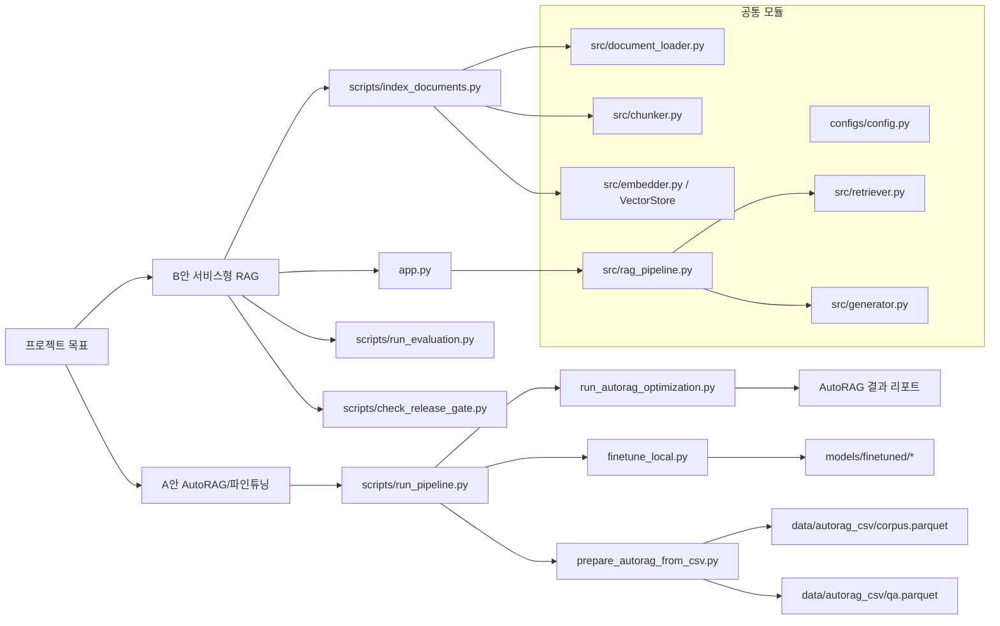
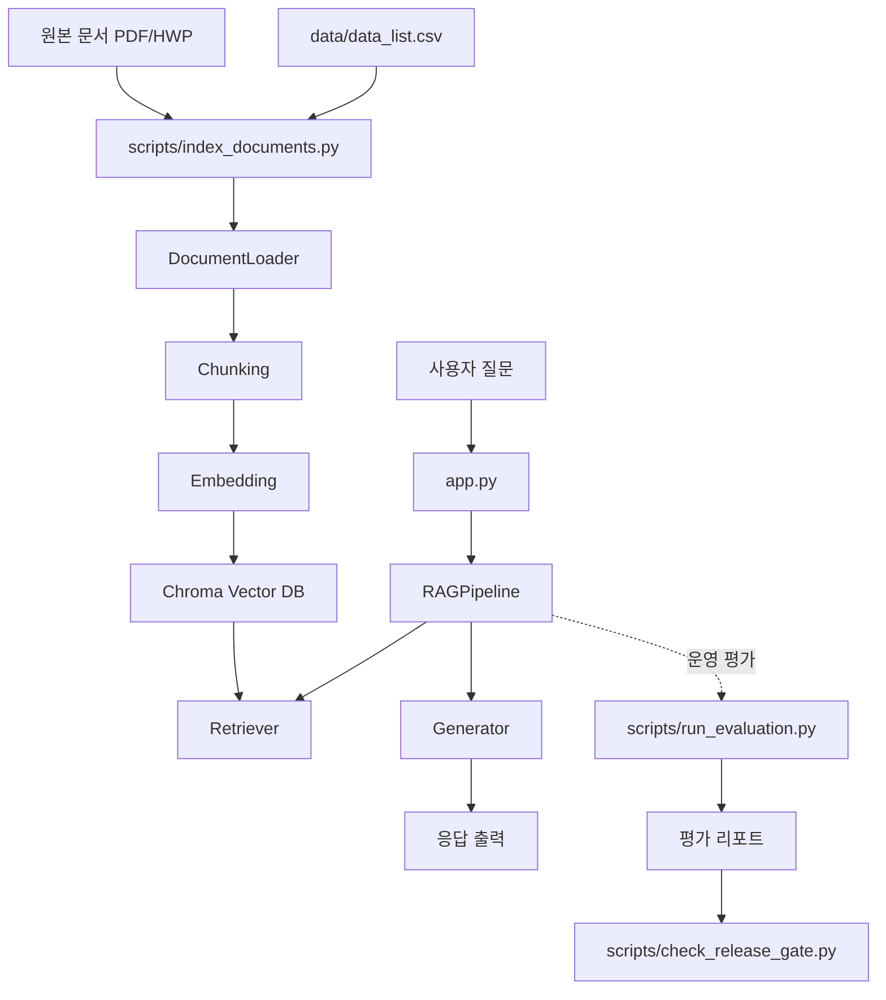
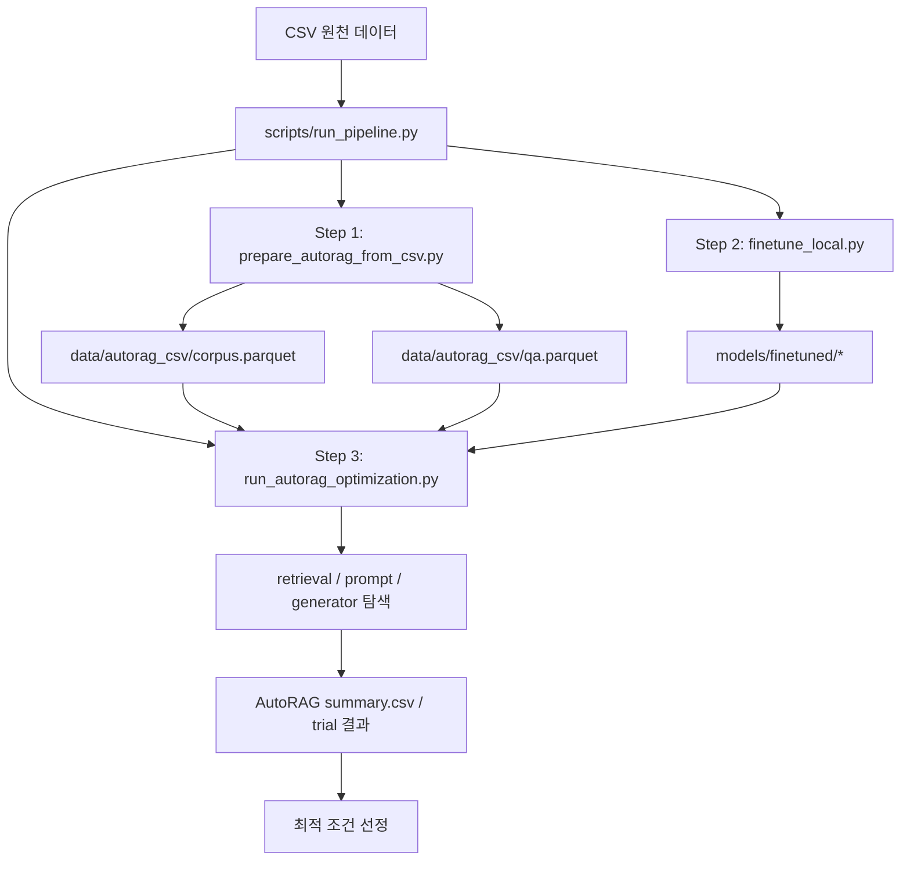
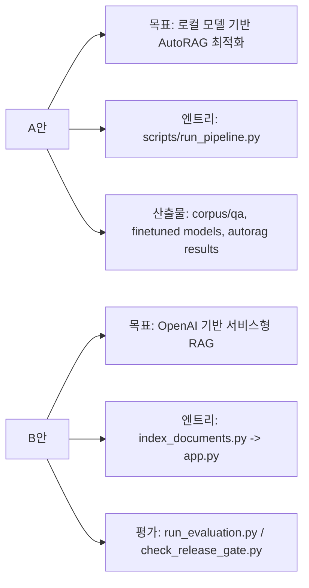

# Project Diagrams

현재 코드 기준으로 정리한 구조 도식입니다.

렌더링 산출물:
- `docs/diagram_architecture.png`
- `docs/diagram_paths.png`
- `docs/diagram.jpg` (동기화 파일)
- `docs/diagram1.jpg` (동기화 파일)

생성 스크립트:
```bash
python3 scripts/generate_diagram_pngs.py
cp docs/diagram_architecture.png docs/diagram.jpg
cp docs/diagram_paths.png docs/diagram1.jpg
```

## 1. 전체 구조



## 2. B안 구조



## 3. A안 구조



## 4. 역할 구분


